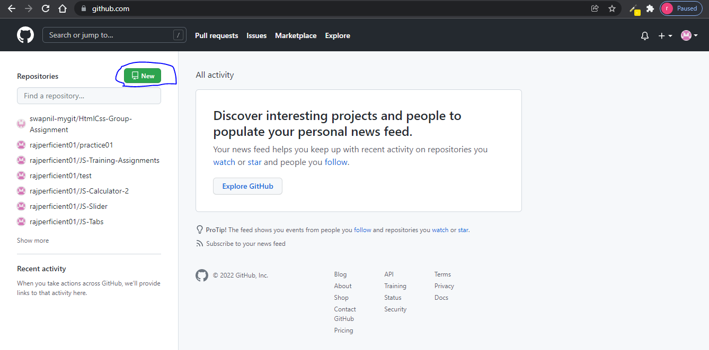
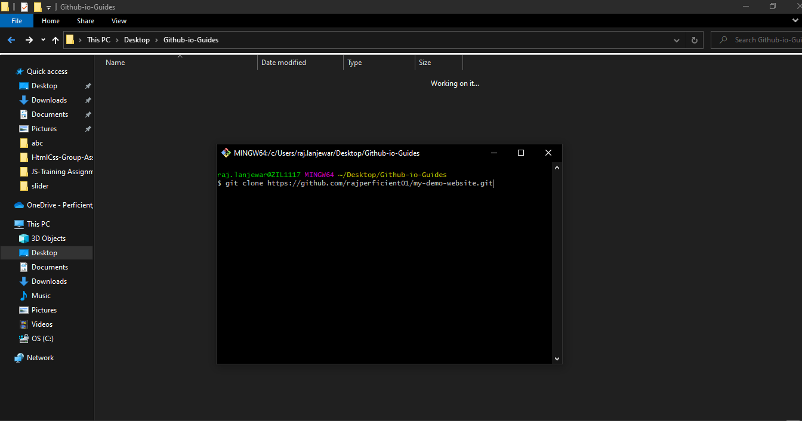

<div align="center">
  <a href="#">
    
  </a>

  <h3 align="center">A Guide to host your Static website with Github Pages</h3>

  <p align="center">
    <a href="https://youtu.be/7BE2FHu3l9o"><strong>Watch step by step guide video »</strong></a>
  </p>
</div>

## Step by step guides:




1)<b> Step 1</b>:  Visit to Github.com and Create new repository by clicking "New"


2) <b>Step 2</b>: provide repository name (in our case *my-demo-website),   *important Choose "Public" and click Create repository
	<small>(reason of choosing public is that in Basic/Free plan Github only allow Github pages repository to be public)</small>
  


3) <b>Step 3</b>: Copy the highlighted link, Create any folder in Desktop -> Open it -> Right click inside folder and open Git Base Here 
	[if you are not have git base installed visit to following link https://git-scm.com/downloads  download and install it].
  
  

4) <b>Step 4</b>: Goto github.com you can see repository that we just created copy full .git link by clicking copy icon.  In Git Base terminal write following commands 

	```
	git clone https://github.com/rajperficient01/my-demo-website.git
	```
	
	
and hit enter
Now inside your folder you can see one folder is being created  -> close Git Bash now -> open newly created folder(in our case my-demo-website folder) and now open 
Git Base here by right clicking here.
  


5) <b>Step 5</b>: Next step is to paste your source code here : copy and paste your code all files -> In git base type following commands

	
	```
	git status
	git add .
	git commit -m "initial commit"
	git push
	```

  


6) <b>Step 6</b>: And now if you visit to Github.com you can see your files added (refresh the browser)

7) <b>Step 7</b>: Open the setting tab


8) <b>Step 8</b>: scroll down -> in left menu clicke on <b>"Pages"</b>


9) <b>Step 9</b>: Now inside Source dropdown choose <b>"Main"</b> (main in branch name-your main/origin branch) -> next dropdown is automatically selected leave it default
and now click on "Save"


10) <b>Step 10</b>: the page is automatically refreshing and after that you will get link to your live website
--> And now share this link with your friends
```
https://rajperficient01.github.io/my-demo-website/ 
```

	


